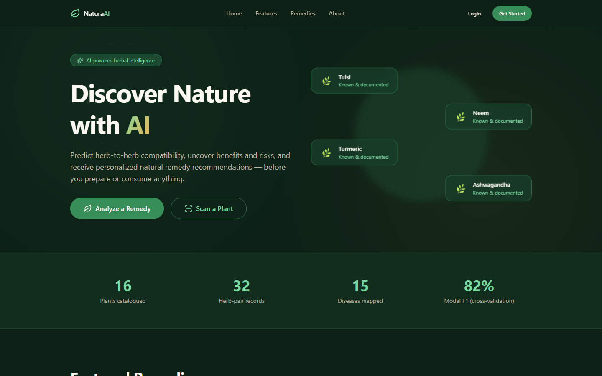
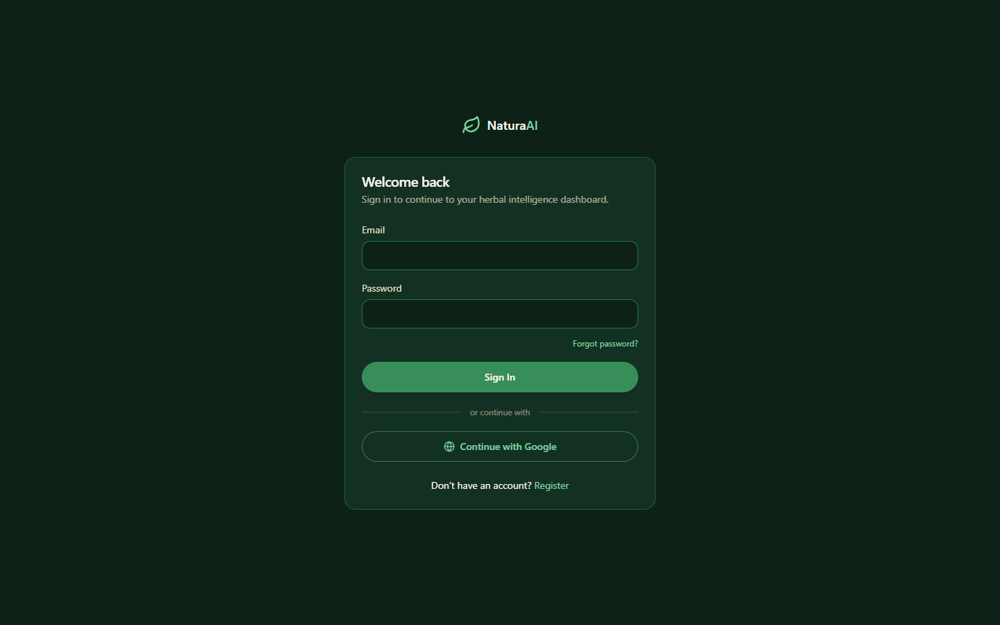
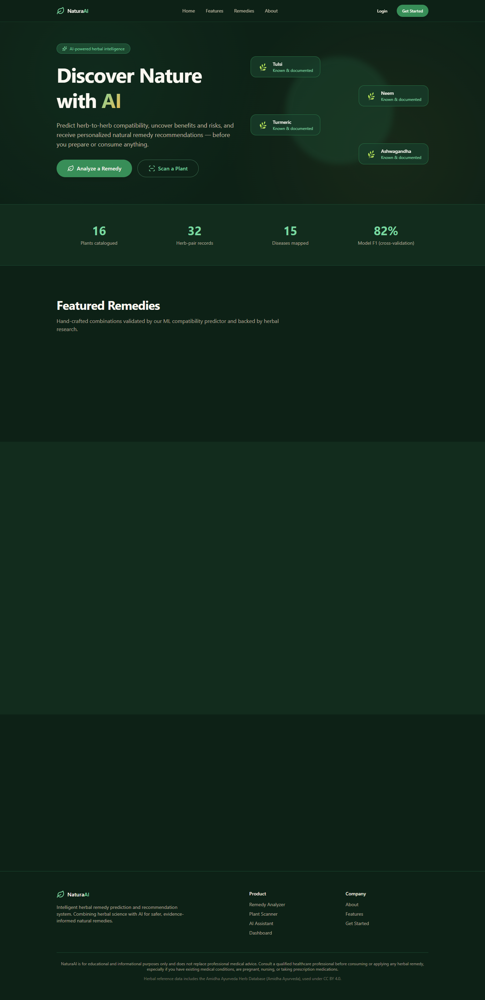

# NaturaAI — Intelligent Herbal Remedy Prediction & Recommendation System

> **AI-powered herbal intelligence:** predict herb-to-herb compatibility, surface
> benefits and risks, and receive personalized, safety-aware remedy recommendations.

[](https://github.com/methila-2056/NaturaAI/actions/workflows/ci.yml)
[](https://naturaai-frontend.vercel.app)
[](https://naturaai-backend.onrender.com)
[](https://naturaai-backend.onrender.com)
[](https://neon.tech)
[](#license)

---

## Live Demo

| Service  | URL                                          | Status |
|----------|----------------------------------------------|--------|
| Frontend | https://naturaai-frontend.vercel.app         | Live   |
| Backend  | https://naturaai-backend.onrender.com        | Live   |
| Database | Neon PostgreSQL (scale-to-zero)              | Live   |

> **Disclaimer:** NaturaAI is an educational project. It does **not** replace
> professional medical advice. Always consult a qualified healthcare professional
> before consuming or applying any herbal remedy, especially if you have existing
> medical conditions, are pregnant, nursing, or taking prescription medications.

---

## Table of Contents

- [Screenshots](#screenshots)
- [Overview](#overview)
- [Features](#features)
- [Core Flow](#core-flow)
- [Architecture](#architecture)
- [Tech Stack](#tech-stack)
- [Repository Structure](#repository-structure)
- [Getting Started](#getting-started)
- [Running Tests](#running-tests)
- [Deployment](#deployment)
- [Documentation](#documentation)
- [Contributing](#contributing)
- [Security](#security)
- [License](#license)

---

## Screenshots

Live deployment captured from the production frontend (Vercel).

| Home — Landing Page | Sign In |
|:-------------------:|:-------:|
|  |  |

<details>
<summary><b>Full-page preview</b></summary>

<a href="docs/screenshots/home-full.png">
  
</a>

Click the preview to open the full-resolution image.

</details>

---

## Overview

NaturaAI is an AI-powered healthcare and herbal intelligence platform that helps
users discover safe and effective natural remedies built from medicinal plants,
herbs, flowers, roots, fruits, and other naturally occurring ingredients.

The system combines:

- **Herbal Knowledge Base** — 368+ curated herbs with scientific names, properties,
  benefits, side effects, contraindications, and preparation methods
- **AI Prediction Engine** — ensemble ML compatibility predictor with a
  deterministic rule-based fallback
- **Medical Compatibility Predictor** — profile-aware verdicts
  (`SAFE` / `CAUTION` / `UNSAFE`) with quantitative safety, benefit, risk,
  and confidence scores
- **Personalized Remedy Generator** — recommendations contextualized by age,
  gender, existing diseases, allergies, and internal/external treatment needs
- **Natural Product Formulation Assistant** — preparation steps, dosage, and
  usage frequency
- **Grounded LLM Health Assistant** — retrieval-first chatbot with optional
  LLM-backed explanations

**Safety-first by design:** every prediction is contextualized against the user's
health profile, unknown combinations default to `CAUTION` (never unverified
`SAFE`), and every consumer-facing output carries a medical disclaimer.

---

## Features

- **Remedy Analyzer** — multi-ingredient compatibility analysis (search, pick,
  or custom add) with verdict, toxicity level, five scores, benefits vs. risks,
  preparation, dosage, frequency, and rationale
- **Personalized Recommendations** — disease-to-herb mapping with avoidance and
  allergen filtering (diabetes, hypertension, asthma, PCOS, thyroid, and more)
- **AI Complementary-Ingredient Suggestions** — ranked by model verdict +
  confidence
- **Grounded Assistant** — natural-language Q&A over the knowledge base,
  including Hindi/vernacular aliases (tulsi, haldi, adrak, methi)
- **Plant Scanner** — image upload with plant identification
- **Health Profile** — age, gender, conditions, allergies, medications, lifestyle
- **Dashboard** — saved remedies, analysis history, profile summary
- **Authentication** — email/password with JWT, email verification,
  forgot/reset password, and Google OAuth2 Sign-In
- **Graceful Degradation** — the core app keeps working when the ML engine is
  unreachable (rule-based fallback)
- **Observability** — `/health` liveness endpoints, structured logging, and a
  three-suite CI pipeline

---

## Core Flow

1. **Landing page** (`/`) — hero, capabilities, featured herbs, stats
2. **Authentication** (`/login`, `/register`) — JWT + Google Sign-In
3. **User profile** — age, gender, diseases, allergies, medications, lifestyle
4. **Health information** — diabetes, hypertension, asthma, PCOS, stress, etc.
5. **Remedy type** — internal (tea, juice, powder, capsules) or external
   (face wash, hair oil, soap)
6. **Ingredient selection** — upload image, text search, or pick from database
7. **AI Prediction Engine** — compatibility, safety/benefit/risk scores, toxicity,
   suitability, preparation, dosage, confidence
8. **Dashboard** (`/dashboard`) — saved remedies, history, analytics, plant scanner

---

## Architecture

```
Browser
   │ HTTP/HTTPS
   ▼
┌────────────────────┐      ┌────────────────────────┐
│ Frontend           │      │ Backend                │
│ Next.js + React 19 │─────▶│ Spring Boot 4 / Java 21│────▶ PostgreSQL (Neon)
│ TypeScript         │ HTTP │ JWT + OAuth2           │───▶ Redis (cache)
│ Tailwind/ShadCN    │      │ JPA / Hibernate        │───▶ RabbitMQ (async)
└────────────────────┘      └───────────┬────────────┘
                                        │ REST
                               ┌────────▼───────────┐
                               │ ML Engine          │───▶ Qdrant (vectors)
                               │ FastAPI (Python)   │───▶ models/predictor.joblib
                               └────────┬───────────┘
                                        │ optional
                                        ▼
                          LLM (Llama 4 / Gemma / Mistral / OpenAI)
```

Three independent services, each deployed on its own free tier. See
[Deployment](#deployment) and [`docs/architecture.md`](docs/architecture.md).

---

## Tech Stack

| Layer     | Technology                                                        |
|-----------|-------------------------------------------------------------------|
| Frontend  | Next.js 15/16, React 19, TypeScript, Tailwind CSS 4, ShadCN UI, Framer Motion, Zustand |
| Backend   | Java 21, Spring Boot 4, Spring Security, Spring Data JPA, Hibernate, Maven, REST APIs |
| Database  | PostgreSQL (Neon-compatible), pgAdmin 4                           |
| AI/ML     | Python, Scikit-Learn, TensorFlow, PyTorch, XGBoost, LightGBM, Hugging Face, LangChain |
| LLM       | Llama 4, Gemma, Mistral, OpenAI API (pluggable)                   |
| Vector DB | Qdrant                                                            |
| Auth      | JWT, OAuth2, Google Login                                         |
| Infra     | AWS S3, RabbitMQ, Redis, Docker, Docker Compose, GitHub Actions   |
| Deploy    | Vercel (frontend), Docker + Render (backend), Neon PostgreSQL     |

---

## Repository Structure

```
NaturaAI/
├── frontend/        # Next.js (React, TypeScript, Tailwind, ShadCN-style UI, Framer Motion, Zustand)
├── backend/         # Spring Boot 4 / Java 21 (REST API, JWT + OAuth2, JPA, Redis, RabbitMQ)
├── ml-engine/       # Python (FastAPI, Scikit-Learn, XGBoost, LightGBM, TensorFlow, LangChain)
├── docs/            # Architecture + database schema documentation, screenshots
├── docker-compose.yml
├── render.yaml
└── .github/workflows/ci.yml
```

---

## Getting Started

### Prerequisites

- **Docker** + Docker Compose
- **JDK 21** and **Maven 3.9+** (backend)
- **Node.js 18+** and **npm** (frontend)
- **Python 3.10+** (ML engine)

### 1. Infrastructure (Docker)

```bash
docker compose up -d postgres redis rabbitmq qdrant
```

### 2. ML Engine

```bash
cd ml-engine
python -m venv .venv
.venv\Scripts\activate          # Windows (macOS/Linux: source .venv/bin/activate)
pip install -r requirements.txt
uvicorn app.main:app --reload --port 8000
```

### 3. Backend

```bash
cd backend
mvn spring-boot:run
```

Requires JDK 21 and Maven 3.9+. See [`backend/README.md`](backend/README.md).

### 4. Frontend

```bash
cd frontend
npm install
npm run dev
```

Open http://localhost:3000

### Full stack with Docker

```bash
docker compose up -d --build
# Frontend http://localhost:3000 · Backend http://localhost:8080 · ML http://localhost:8000
# pgAdmin http://localhost:5050 · RabbitMQ http://localhost:15672
```

---

## Running Tests

Every push to `main`/`develop` runs all three suites in CI
([`.github/workflows/ci.yml`](.github/workflows/ci.yml)). Run them locally:

```bash
# Backend (JUnit 5 + Mockito)
cd backend && mvn test

# Frontend (Vitest + React Testing Library)
cd frontend && npm run test

# ML Engine (pytest)
cd ml-engine && python -m pytest -q
```

---

## Deployment

The project ships as three independent services, each on a free tier:

| Piece      | Provider            | Free tier                                                        |
|------------|---------------------|------------------------------------------------------------------|
| Frontend   | Vercel              | Hobby (100 GB bandwidth/mo, 1M function invocations)             |
| Backend    | Render              | Free web service (512 MB RAM, 750 hrs/mo, spins down when idle)   |
| Database   | Neon                | Free Postgres (0.5 GB/project, scale-to-zero, no card)            |
| ML engine  | Render (optional)   | Free web service (FastAPI + trained model; backend falls back to heuristics if down) |

### Production URLs (as deployed)

| Service  | URL                                          | Notes |
|----------|----------------------------------------------|-------|
| Backend  | `https://naturaai-backend.onrender.com`      | The `onrender.com` subdomain slug is **immutable** (fixed at creation) — to use a different hostname you must link a [custom domain](https://render.com/docs/custom-domains). |
| Frontend | `https://naturaai-frontend.vercel.app`       | Vercel project `naturaai-frontend`, root dir `frontend`. |
| Database | Neon project (scale-to-zero)                 | Backend connects via `DATABASE_URL`; tables auto-create on boot. |

> The Google OAuth **Authorized redirect URI** is `https://naturaai-backend.onrender.com/login/oauth2/code/google`
> and Vercel's `NEXT_PUBLIC_API_URL` points to the same backend URL. If you ever link a custom
> domain, update both of these together.

### Environment variables

| Variable                 | Where                 | Purpose                                            |
|--------------------------|-----------------------|----------------------------------------------------|
| `DATABASE_URL`           | Backend (host)        | JDBC URL of the cloud Postgres. Must use the query-param form (the driver rejects `user:pass@host` URLs): `jdbc:postgresql://<host>/<db>?user=<user>&password=<pass>&sslmode=require` |
| `DB_HOST`/`DB_PORT`/`DB_NAME`/`DB_USER`/`DB_PASSWORD` | Backend | Split form used when `DATABASE_URL` is empty (local dev) |
| `JWT_SECRET`             | Backend (host)        | At least 32 random bytes — generate with `openssl rand -base64 48` |
| `ALLOWED_ORIGINS`        | Backend (host)        | Comma-separated frontend origins allowed by CORS |
| `FRONTEND_URL`           | Backend (host)        | Frontend origin (used in emails/redirects)        |
| `ML_ENGINE_URL`          | Backend (host)        | URL of the deployed ML engine                      |
| `PORT`                   | Backend (host)        | Set automatically by the host (Render injects it)  |
| `NEXT_PUBLIC_API_URL`    | Frontend (Vercel)     | Backend URL, e.g. `https://<backend>.onrender.com` |
| `NEXT_PUBLIC_ML_URL`     | Frontend (Vercel)     | ML engine URL                                      |
| `NEXT_PUBLIC_GOOGLE_CLIENT_ID` | Frontend (Vercel) | Optional Google Sign-In client ID                 |
| `OPENAI_API_KEY`         | ML engine (host only) | Optional LLM explanations — **never** in frontend code or env |
| `GOOGLE_CLIENT_ID`/`GOOGLE_CLIENT_SECRET` | Backend | Optional Google OAuth login. Authorized redirect URI must be `https://<backend>.onrender.com/login/oauth2/code/google` (Spring Security's default path) |
| `SMTP_*` / `MAIL_FROM`   | Backend               | Optional email delivery (prints to console when empty) |

Secrets live only in the hosting provider's dashboard (Vercel/Render/Neon). `.env` files are
git-ignored; `.env.example` contains placeholders only.

### 1. Database — Neon (free)

1. Sign up at <https://neon.tech> (free, no card).
2. Create a project → copy the connection string from the dashboard.
3. Convert it to the JDBC form the backend expects:
   `postgresql://<user>:<pass>@<host>/<db>` → `jdbc:postgresql://<host>/<db>?user=<user>&password=<pass>&sslmode=require`
   (the `user:pass@host` form is rejected by the PostgreSQL JDBC driver).
4. Tables are created automatically on first backend boot (`ddl-auto: update`) and seed data
   (herbs, disease guidance) is loaded by `DataSeeder`. Optionally run
   `docs/database-schema.sql` in the Neon SQL editor first.

### 2. Backend — Render (free)

1. Push this repository to GitHub.
2. In the Render dashboard choose **New → Blueprint**, import the repo, and select
   `render.yaml`.
3. Fill in the env vars that are marked "from environment":
   - `DATABASE_URL` — Neon JDBC URL from step 1
   - `JWT_SECRET` — `openssl rand -base64 48`
   - `ALLOWED_ORIGINS` — your Vercel frontend URL (e.g. `https://naturaai-frontend.vercel.app`)
   - `FRONTEND_URL` — same URL
   - `ML_ENGINE_URL` — the Render URL of the ML engine (optional)
4. Apply — Render builds `backend/Dockerfile` (Java 21) and serves it on `PORT` (injected).

Free-tier notes: the instance spins down after ~15 min idle (30–60 s cold start) and only one
free web service is allowed per account — see the ML engine note below.

### 3. ML engine — Render (optional)

The backend analyzes remedies through `ML_ENGINE_URL` and falls back to a built-in heuristic when
it is unreachable, so the core app works without it. To also deploy the ML engine:

- Add a second web service from `ml-engine/Dockerfile` (Python/FastAPI).
- Set `OPENAI_API_KEY` there (env only) if you want optional LLM explanations.
- Render free accounts allow a single free web service; the ML engine must then be added on a
  paid plan, a second Render account, or another host (e.g. a free Oracle Cloud VM).

### 4. Frontend — Vercel (free)

1. In the Vercel dashboard choose **Add New → Project** and import the GitHub repo.
2. Set **Root Directory** to `frontend`.
3. Add env vars: `NEXT_PUBLIC_API_URL=https://<backend>.onrender.com`,
   `NEXT_PUBLIC_ML_URL=https://<ml-engine>.onrender.com`.
4. Deploy. The `npm run build` produces fully static pages; no runtime server is needed.

### CORS

The backend allows only origins listed in `ALLOWED_ORIGINS` (defaults to localhost dev origins).
Set it to your deployed Vercel domain — never `*` in production.

---

## Documentation

- [Architecture](docs/architecture.md)
- [Database Schema](docs/database-schema.sql)
- [Product Requirements (PRD)](PRD.txt)
- [Business Requirements (BRD)](BRD.txt)
- [Contributing Guidelines](CONTRIBUTING.md)
- [Security Policy](SECURITY.md)

---

## Contributing

Contributions are welcome! Please read [CONTRIBUTING.md](CONTRIBUTING.md) first.
For security issues, follow the disclosure process in [SECURITY.md](SECURITY.md).

---

## License

Educational project for B.Tech CSE. Intended for informational purposes only.
Herbal data is attributed to the Amidha dataset (CC-BY-4.0) where applicable.
